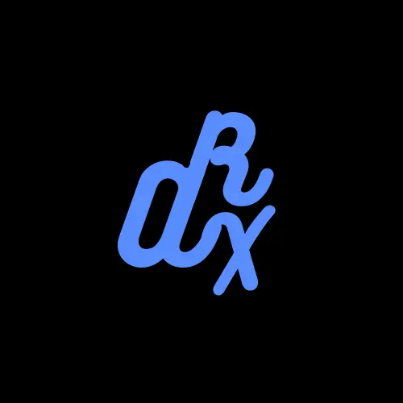
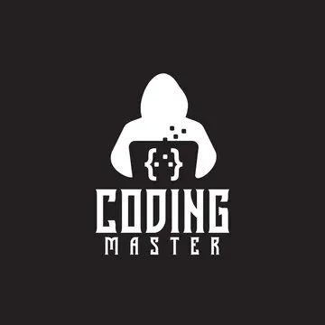

# Profiden - Your Online Profile in a Few Clicks!

Profiden is a free and user-friendly online platform that allows you to create your personalized online profile with ease. With its responsive design, appealing UI, and hassle-free process, Profiden makes it simple for anyone to showcase their skills, interests, and accomplishments to the world. 

## Features:
- **Free**: Profiden is completely free to use, ensuring accessibility for everyone.
- **Responsive**: The platform is designed to work seamlessly on various devices, from desktops to mobile phones.
- **Easy to Use**: Creating your online profile is a breeze with Profiden's intuitive and straightforward interface.
- **Good UI**: We've focused on providing a clean and visually pleasing user interface to enhance your profile presentation.
- **Testimonials**: Let others vouch for your skills! Collect testimonials to add credibility to your profile.
- **Looks Cool**: Stand out from the crowd with stylish and modern profile layouts.

## Getting Started:
1. **Create Account**: Sign up with Profiden to begin building your online profile.
2. **Customize Your Profile**: Add your personal information, skills, projects, and more to make your profile unique.
3. **Share It with the World**: Once your profile is ready, share it with others to showcase your achievements.

## Our Team:

|   |   |   |
|---|---|---|
|    
Axorax
 |    
Cactochan
 |    
Coder Master
 |
| 
Programmer
 | 
Programmer
 | 
Programmer
 |

## Contact Us:
- Discord: @cactochan
- Email: [profiden@fbi.ac](mailto:profiden@fbi.ac)

---

Feel free to contribute to this project by reporting issues, suggesting improvements, or submitting pull requests. Let's make Profiden even better together!
